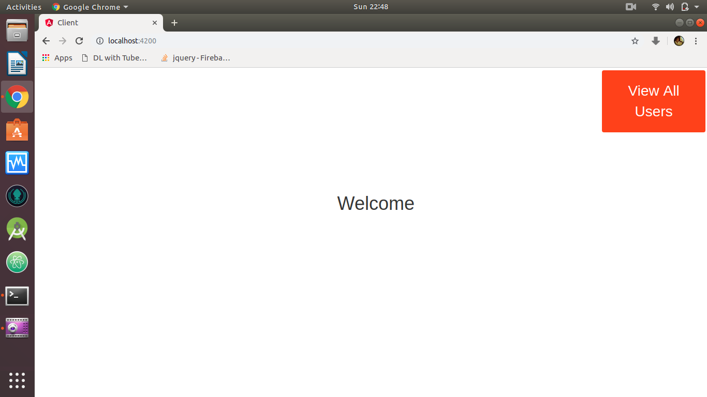
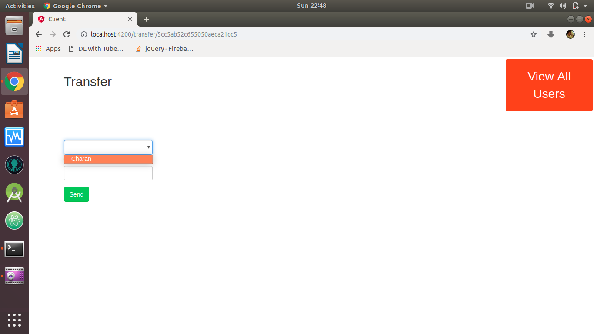
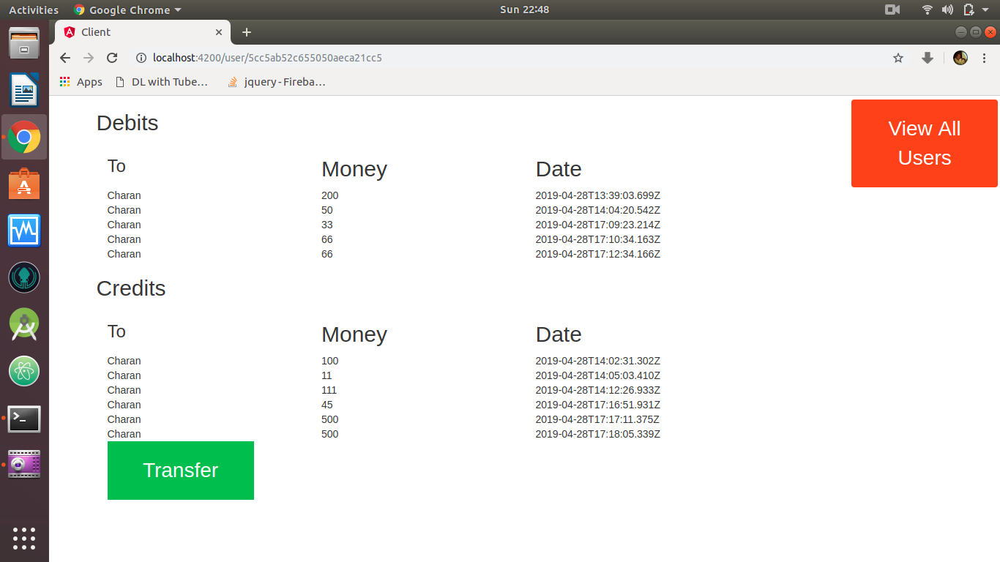
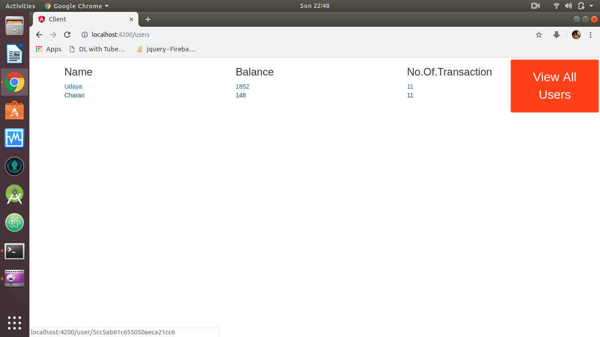

Intern 
&nbsp;&nbsp;&nbsp;This is a MEAN Stack Development Project. 
&nbsp;&nbsp;&nbsp;First start the mongodb service in your computer. 
&nbsp;&nbsp;&nbsp;Run server using "nodemon" if nodemon installed . Else start using "node server.js" by installing node.js 

IT IS HOSTED ON: https://hidden-dusk-39316.herokuapp.com/  
DEMO VIDEO https://github.com/Lionertic/Intern/raw/master/Demo/video_demo.mp4

***screenshot::***&nbsp;

  
  
  
  

